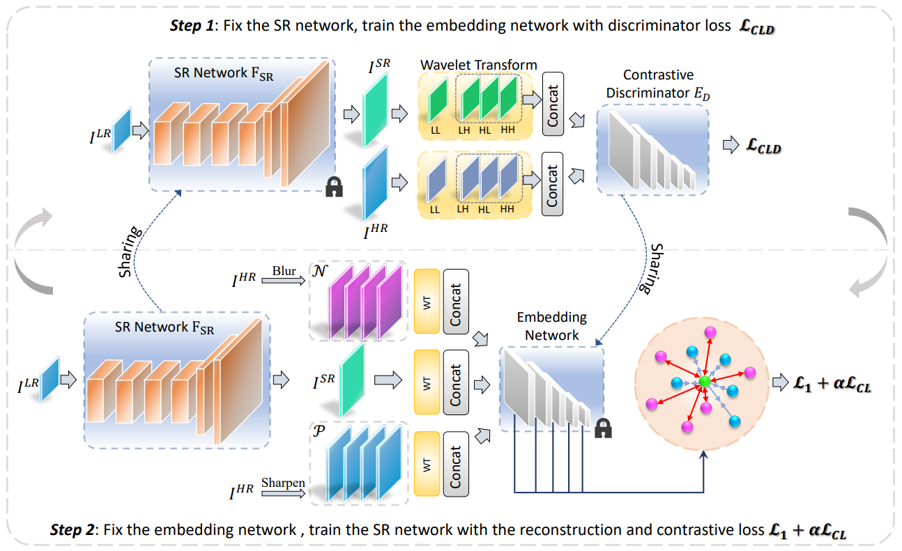

# CL_loss of PCL-SISR
There is an unofficial implementation for the proposed CL_loss, which is proposed in "A Practical Contrastive Learning Framework for Single Image Super-Resolution" (2021).

More details please refer to the paper https://arxiv.org/pdf/2111.13924.pdf .

## pos_neg_examples_generator.py
A batchwise postive and negtative examples generator. In this file, we design positive and negative examples by a Laplace operator and a random Gaussian filter, respective. You can change these operations and the corresponding example numbers for your own strategy.

## cl_loss.py
A certain-layer in-batch InfoNCE implementation in this paper. The authors choose different layer's feature map for the loss computation, but it can also be used for a certain layer. If you want to realize the multi-layer CL_loss computation, please return different-layer feature maps in your network and call this function `InfoNCE_SingleLayer` several times, then the mean value of the results is what your need.
